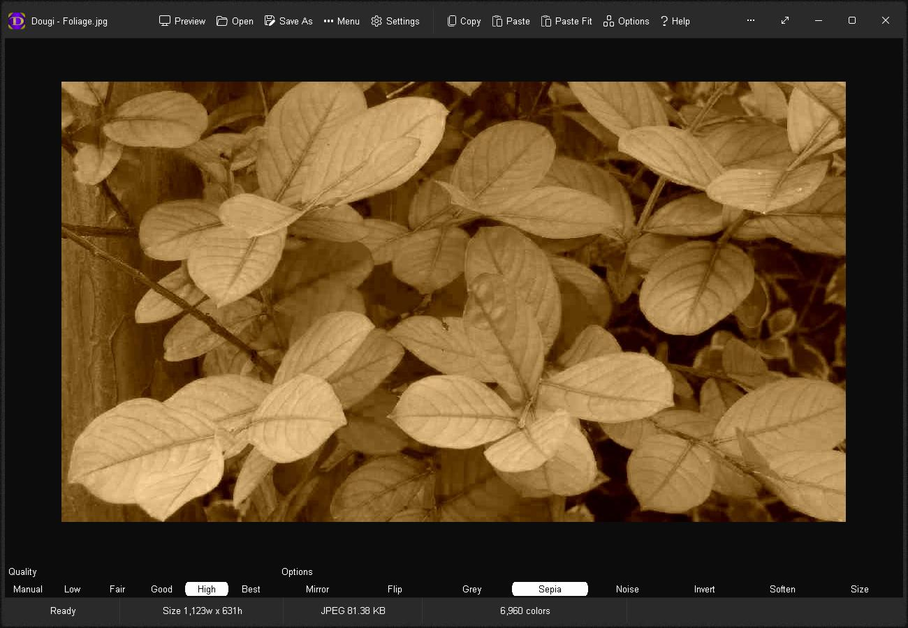

# Dougi
Create quality JPEG images fast with ease.  Simply paste in an image, or drag and drop an image, set the desired quality and save.  Done.  With a realtime WYSIWYG (What You See Is What You Get) preview, you see image quality changes as you go.  Never guess the right JPEG quality again.

<video src="images/dougi-animated5.mp4" width="300" /> </video>

# Features
* WYSIWYG (What You See Is What You Get) display
* Manual Quality (5-100%): View changes to JPEG image in realtime
* Automatic Quality: Low, Fair, Good, High and Best
* Size: Enforce an optional maximum JPEG file size limit (5-4,000 KB) 
* Image Adjustments: Mirror, Flip, Grey, Sepia, Noise, Invert and Soften
* Realtime Information: Dimensions, JPEG file size and Color Count
* Open image formats: PNG, GIF, JPG, JIF, JPEG, TJ32, BMP, ICO, CUR, ANI, TEA and IMG32
* Save image formats: JPG, JIF and JPEG
* Screen Color: Default, Grey, Light Grey, Black, White, Off White and Custom
* Fit To Screen: Force image to fit the screen for overview
* Batch Conversion: Drag and drop 2 or more images to batch convert
* Batch Convert Options: Save JPG, JPEG and JIF formats
* Show Batch Conversion folder after convert
* Max: Toggle fullscreen mode
* Preview: View JPEG image in your web browser
* Simple and easy to use
* Built-in Help
* App is portable with no installation (works in a folder) and runs offline without the internet

# Download
<a href="src/dougi.exe">dougi.exe</a> - windows all

# Images

